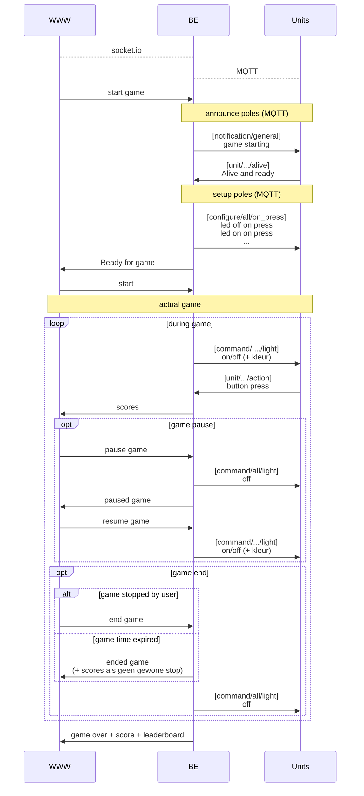

```mermaid
sequenceDiagram
    WWW --> BE: socket.io
    BE --> Units: MQTT
    WWW ->> BE: start game
    Note over BE, Units: announce poles (MQTT)

    BE ->> Units: [notification/general]<br> game starting
    Units ->> BE: [unit/.../alive]<br> Alive and ready

    Note over BE, Units: setup poles (MQTT)

    BE ->> Units: [configure/all/on_press] <br> led off on press <br> led on on press <br> ...
    BE ->> WWW: Ready for game

    WWW ->> BE: start
    Note over WWW, Units: actual game
    loop during game
        BE ->> Units: [command/..../light] <br> on/off (+ kleur)
        Units ->> BE: [unit/.../action] <br> button press
        BE ->> WWW: scores

        opt game pause
            WWW ->> BE: pause game
            BE ->> Units: [command/all/light] <br> off
            BE ->> WWW: paused game
            WWW ->> BE: resume game
            BE ->> Units: [command/.../light] <br> on/off (+ kleur)
        end

        opt game end
            alt game stopped by user
                WWW ->> BE: end game
            else game time expired
                BE ->> WWW: ended game <br> (+ scores als geen gewone stop)
            end
            BE ->> Units: [command/all/light] <br> off
        end
    end
    BE ->> WWW: game over + score + leaderboard
```

